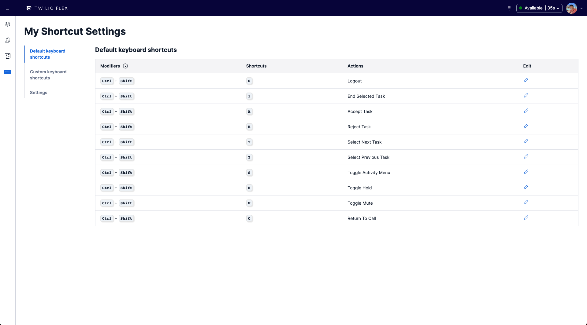
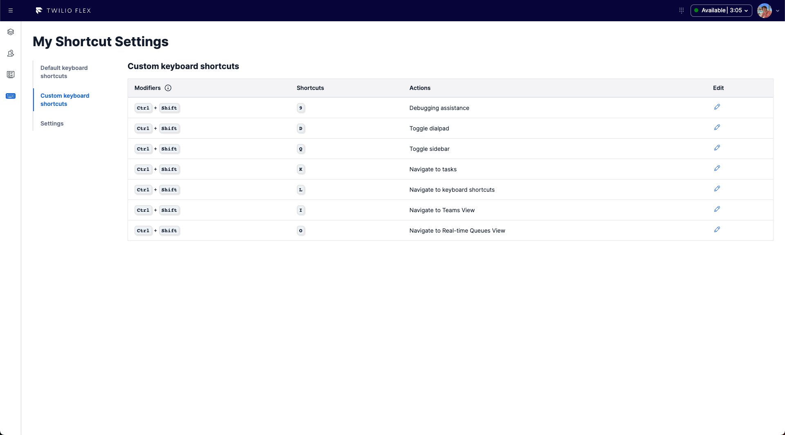
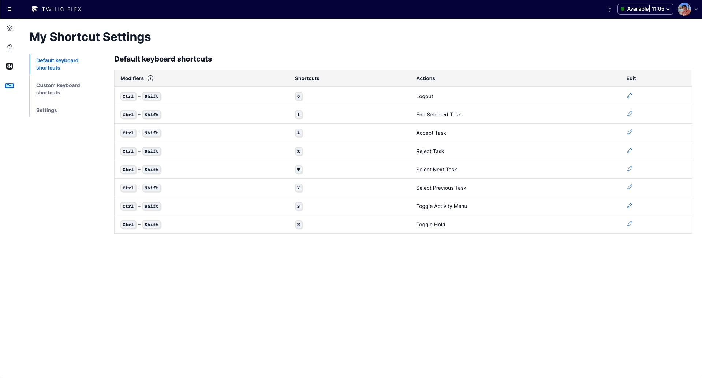
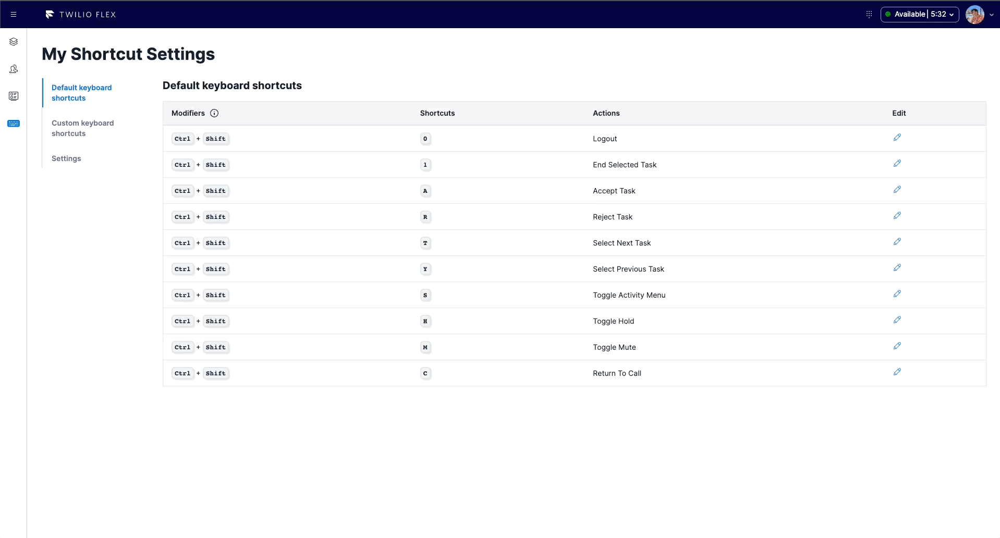
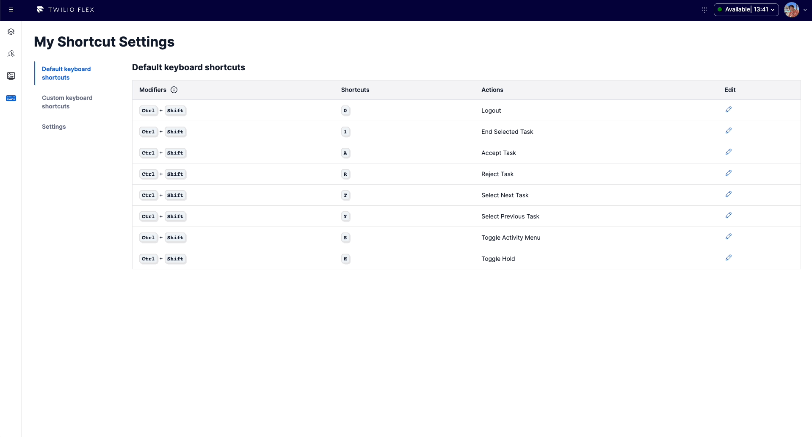
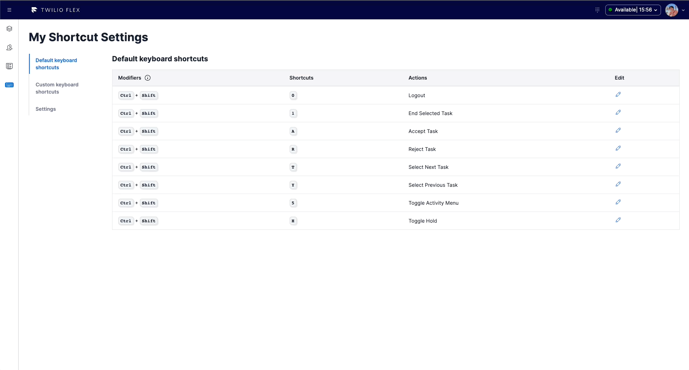
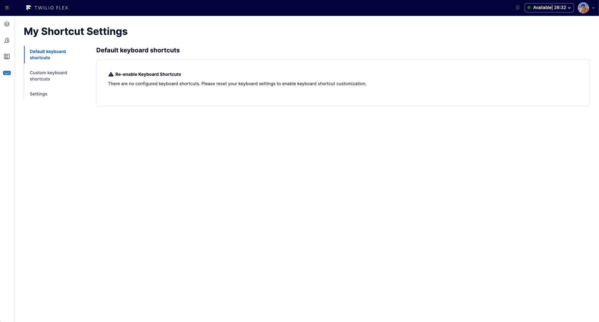

<a  href="https://www.twilio.com">

</a>

# Keyboard Shortcuts Manager - Flex 2.1+

Twilio Flex plugin that empowers contact center users to configure default and custom keyboards shortcuts in their day-to-day activities to increase efficiency and enjoyment when using Twilio Flex.

# Table of Contents

- [Keyboard Shortcuts Manager - Flex 2.1+](#keyboard-shortcuts-manager---flex-21)
- [Table of Contents](#table-of-contents)
  - [What does it do?](#what-does-it-do)
  - [How does this work?](#how-does-this-work)
    - [How are you persisting changes between refreshes?](#how-are-you-persisting-changes-between-refreshes)
    - [Default keyboard shortcuts](#default-keyboard-shortcuts)
    - [Custom keyboard shortcuts](#custom-keyboard-shortcuts)
    - [Supported Flex version](#supported-flex-version)
  - [Development](#development)
- [Configuration](#configuration)
  - [Requirements](#requirements)
  - [Setup](#setup)
  - [Flex Plugin](#flex-plugin)
    - [Development](#development-1)
    - [Deploy your Flex Plugin](#deploy-your-flex-plugin)
  - [License](#license)
  - [Disclaimer](#disclaimer)

---

## What does it do?

The _Keyboard Shortcuts Manager_ Twilio Flex plugin empowers contact center users to configure default and custom keyboards shortcuts in their day-to-day activities to increase efficiency and enjoyment when using Twilio Flex.

## How does this work?

With the release of Flex 2.1, Flex now supports keyboards shortcuts for the most common actions performed by agents. The official documentation can be found [here](https://www.twilio.com/docs/flex/end-user-guide/keyboard-shortcuts).

The 2.1 Flex UI exposes various APIs to interact with the default keyboard shortcuts, as well as adding custom ones. The official documentation can be found [here](https://www.twilio.com/docs/flex/developer/ui/modify-keyboard-shortcuts).

The plugin is available to both agents and supervisors alike and it allows the following functionalities:

**View default Flex keyboard shortcuts:**



This view allows users to see the default Flex keyboard shortcuts and their current mappings.

**View custom Flex keyboard shortcuts**



This view allows users to see custom added keyboard shortcuts and their current mappings.

**A settings screen for easy management**



**Delete shortcuts**



**Remap a shortcut**



**Adjust key throttling**



**Disable keyboard shortcuts**


**Reset keyboard shortcuts to default values**



### How are you persisting changes between refreshes?

User modification to both default and custom keyboard shortcuts are stored into browser local storage and read during plugin initialization.

### Default keyboard shortcuts

Twilio Flex comes with a list of default shortcuts which can be found [here](https://www.twilio.com/docs/flex/end-user-guide/keyboard-shortcuts).

| Action                          | Description                                                                                                                                                                                                                                                                                                                                                                                                                                                                                                                                                                               | Shortcut                                          |
| ------------------------------- | ----------------------------------------------------------------------------------------------------------------------------------------------------------------------------------------------------------------------------------------------------------------------------------------------------------------------------------------------------------------------------------------------------------------------------------------------------------------------------------------------------------------------------------------------------------------------------------------- | ------------------------------------------------- |
| Toggle status menu              | Opens and closes the agent Activity menu                                                                                                                                                                                                                                                                                                                                                                                                                                                                                                                                                  | CTRL + SHIFT + S                                  |
| Accept task                     | Accepts incoming tasks. Call tasks will always be accepted first. If there are multiple tasks, they will be accepted one at a time in the order they came in (with the oldest first). _If there are no incoming tasks, this shortcut will do nothing._                                                                                                                                                                                                                                                                                                                                    | CTRL + SHIFT + A                                  |
| Reject task                     | Rejects incoming tasks. Call tasks will always be rejected first. If there are multiple tasks they will be rejected one at a time in the order they came to the user (oldest first)._If there are no incoming tasks, this shortcut will do nothing._                                                                                                                                                                                                                                                                                                                                      | CTRL + SHIFT + R                                  |
| Navigate down/up the task list  | Navigates up and down from the currently selected task in the task list. If no task is selected, the top task is selected. Repeated presses will go down and up the list to the next task, looping round to the other end when you reach the top or bottom of the list.                                                                                                                                                                                                                                                                                                                   | CTRL + SHIFT + T (up) and CTRL + SHIFT + Y (down) |
| Toggle mute on active call      | Places yourself on and off mute.                                                                                                                                                                                                                                                                                                                                                                                                                                                                                                                                                          | CTRL + SHIFT + M                                  |
| Toggle hold on active call      | Places the other participant of a call on and off hold. _If there are more than two participants in the call, this shortcut will do nothing and a notification will appear._                                                                                                                                                                                                                                                                                                                                                                                                              | CTRL + SHIFT + H                                  |
| Logout                          | Will log out the user out of Flex UI._If the user has an active call or pending tasks, this shortcut will do nothing._                                                                                                                                                                                                                                                                                                                                                                                                                                                                    | CTRL + SHIFT + 0                                  |
| End the currently selected task | This shortcut has two behaviors based on the channel type and status of the selected task. The first keypress of this shortcut will close the channel and move the task to "wrap up". Ongoing calls will hang up and chats will be ended. If the call has multiple participants, the conference will end for everyone. The second keypress (or if the task is already in "wrap up" mode) will complete the task._There is a 1-second timeout to prevent accidental repeat keypresses. If the shortcut is used a second time too quickly, it will do nothing. A notification will appear._ | CTRL + SHIFT + 1                                  |
| Return to active call           | Will navigate back to the call view if the agent is not on this view.                                                                                                                                                                                                                                                                                                                                                                                                                                                                                                                     | CTRL + SHIFT + C                                  |

### Custom keyboard shortcuts

### Supported Flex version

This plugin only supports Twilio Flex 2.1 and above because support for keyboard shortcuts has been introduced with Flex 2.1.

## Development

Run `twilio flex:plugins --help` to see all the commands we currently support. For further details on Flex Plugins refer to our documentation on the [Twilio Docs](https://www.twilio.com/docs/flex/developer/plugins/cli) page.

# Configuration

## Requirements

To deploy this plugin, you will need:

- An active Twilio account with Flex provisioned. Refer to the [Flex Quickstart](https://www.twilio.com/docs/flex/quickstart/flex-basics#sign-up-for-or-sign-in-to-twilio-and-create-a-new-flex-project%22) to create one.
- Flex version 2.1 or above
- npm version 5.0.0 or later installed (type `npm -v` in your terminal to check)
- Node.js version 12 or later installed (type `node -v` in your terminal to check). _Even_ versions of Node are. **Note:** In order to install Twilio Flex CLI plugin that is needed for locally running Flex, Node version 16 is the latest supported version (if you are using Node 18., please revert back or use Node Version Manager).
- [Twilio CLI](https://www.twilio.com/docs/twilio-cli/quickstart#install-twilio-cli) along with the [Flex CLI Plugin](https://www.twilio.com/docs/twilio-cli/plugins#available-plugins)
- Once the Twilio CLI and Twilio Flex CLI plugins are successfully installed, configure your [Twilio CLI profile](https://www.twilio.com/docs/twilio-cli/general-usage). **Note:** This step is required if you are running Twilio CLI for the first time or if you have multiple Twilio CLI profiles configured.

## Setup

Install the dependencies by running `npm install`:

```bash
cd flex-keyboard-shortcuts
npm install
```

From the root directory, rename `public/appConfig.example.js` to `public/appConfig.js`.

```bash
mv public/appConfig.example.js public/appConfig.js
```

## Flex Plugin

### Development

To run the plugin locally, you can use the Twilio Flex CLI plugin. Using your command line, run the following from the root directory of the plugin.

```bash
cd flex-keyboard-shortcuts
twilio flex:plugins:start
```

This will automatically start up the webpack dev server and open the browser for you. Your app will run on `http://localhost:3000`.

When you make changes to your code, the browser window will be automatically refreshed.

### Deploy your Flex Plugin

Once you are happy with your Flex plugin, you have to deploy then release it on your Flex application.

Run the following command to start the deployment:

```bash
twilio flex:plugins:deploy --major --changelog "Releasing Keyboard Shortcuts Manager" --description "Keyboard Shortcuts Manager"
```

After running the suggested next step, navigate to the [Plugins Dashboard](https://flex.twilio.com/admin/) to review your recently deployed plugin and confirm that it’s enabled for your contact center.

**Note:** Common packages like `React`, `ReactDOM`, `Redux` and `ReactRedux` are not bundled with the build because they are treated as external dependencies so the plugin will depend on Flex to provide them globally.

You are all set to test this plugin on your Flex application!

## License

[MIT](http://www.opensource.org/licenses/mit-license.html)

## Disclaimer

This software is to be considered "sample code", a Type B Deliverable, and is delivered "as-is" to the user. Twilio bears no responsibility to support the use or implementation of this software.
